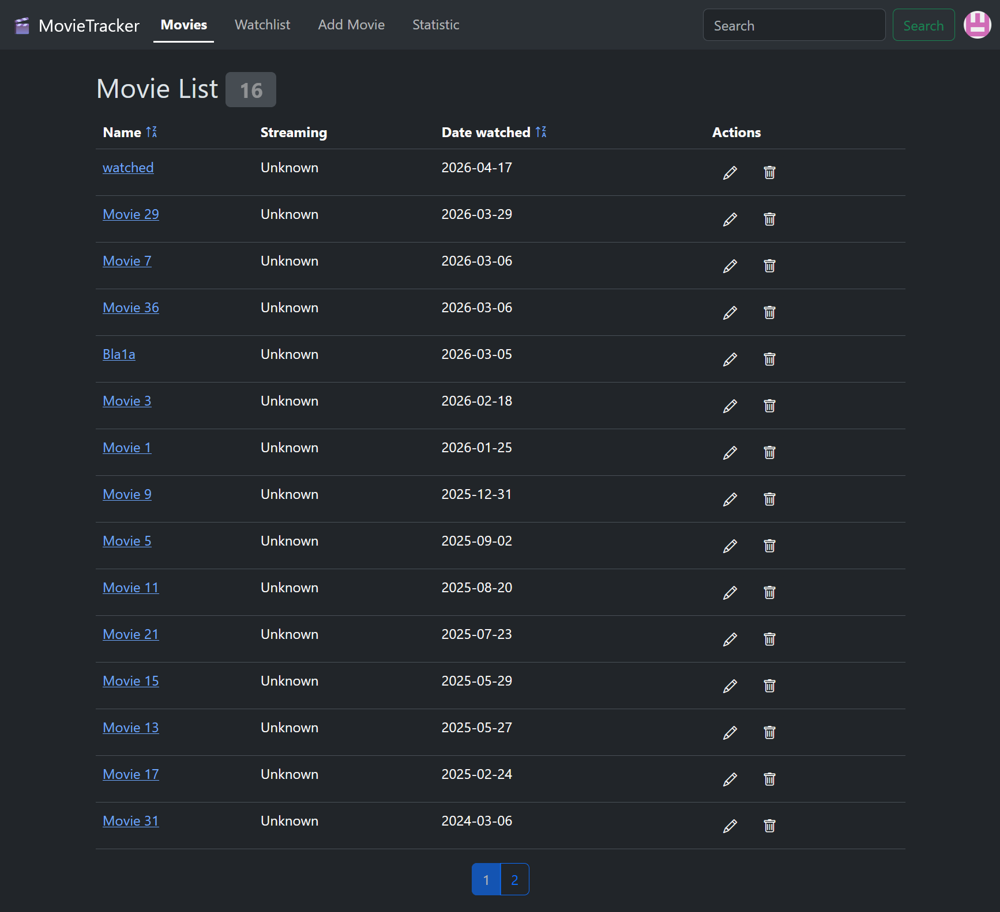

# Movietracker 🎬

A modern Spring Boot web application to manage and track movies you have watched with GitHub OAuth2 authentication.



## Overview

MovieTracker is a user-friendly application that allows you to:
- Login securely with GitHub OAuth2
- Add movies to your collection
- Track movies you have watched
- Search for watched movies
- Update movie details
- Delete movies from your list
- Extract streaming URLs (Netflix, Amazon Prime, YouTube)
- View movie statistics

## Technology Stack

### Backend
- **Spring Boot** - Web Framework
- **Spring Security** - OAuth2 Authentication with GitHub
- **Spring Data JPA** - ORM and Data Access
- **Hibernate** - JPA Implementation
- **H2 Database** - Persistent in-file database
- **Thymeleaf** - Template Engine
- **Lombok** - Reduced Boilerplate Code

### Frontend
- **HTML5** - Markup
- **Bootstrap** - CSS Framework
- **Bootstrap Icons** - Icon Library

## Getting Started

### Prerequisites
Create a GitHub OAuth2 Application:
   - Go to https://github.com/settings/developers
   - Create a new OAuth App
   - Set Authorization callback URL to: `http://localhost:8080/login/oauth2/code/github`
   - Note your Client ID and Client Secret

### Installation & Running Locally

1. **Clone the repository**
   ```bash
   git clone <repository-url>
   cd movietracker
   ```

2. **Configure GitHub OAuth2 credentials**
   Set environment variables:
   ```bash
   # Windows
   set GITHUB_CLIENT_ID="your-client-id"
   set GITHUB_CLIENT_SECRET="your-client-secret"
   
   # Linux/Mac
   export GITHUB_CLIENT_ID="your-client-id"
   export GITHUB_CLIENT_SECRET="your-client-secret"
   ```
   
   Or update `application.properties`:
   ```properties
   spring.security.oauth2.client.registration.github.clientId=your-client-id
   spring.security.oauth2.client.registration.github.clientSecret=your-client-secret
   ```

3. **Start the application**
   ```bash
   ./mvnw spring-boot:run
   ```

4. **Access the application**
   - Open your browser and navigate to: `http://localhost:8080`
   - Click "Login with GitHub" to authenticate
   - The H2 database will be created at: `~/movietrackerdb.mv.db`

## Deployment

### Docker

#### Build
```bash
./mvnw clean package
docker build -t movietracker:latest .
```

#### Run
```bash
docker run --rm -p 8080:8080 \
  -e github-client-id=your-client-id \
  -e github-client-secret=your-client-secret \
  movietracker:latest
```

Then access the application at: `http://localhost:8080`

